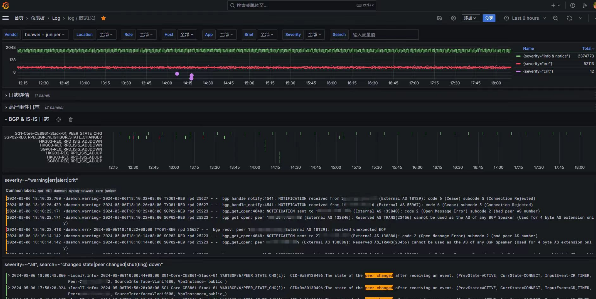
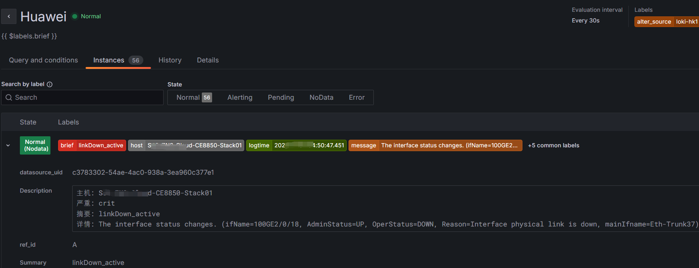
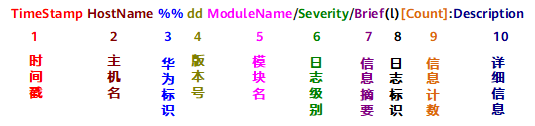
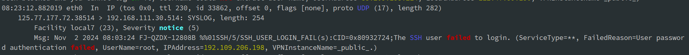
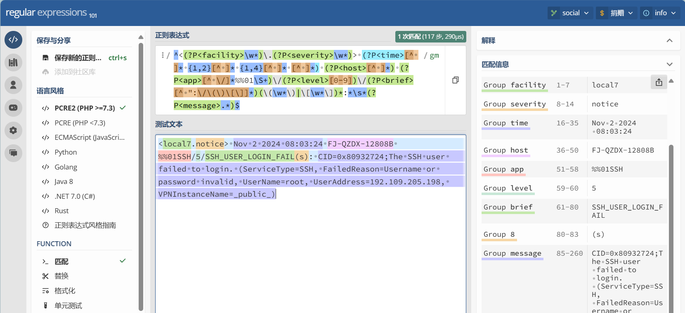

# 前言

通过在本地部署一套 Loki 日志系统，将华为/H3C/Juniper/Cisco 等网络设备的日志集中存储，并使用 Grafana 进行日志管理查询。

之前在网上查看了很多使用Loki收集网络设备日志的教程，无一例外都是非常简单的将日志存储到Loki中，并未使用promtail组件将日志进行解析，使用标签对日志流进行索引和分组，非常失望。

所以花了很长时间去了解syslog协议，rsyslog软件，又踩了很多坑。。。

如果对 [syslog协议](https://mahumac.github.io/posts/syslog-协议简介/) 和 [rsyslog软件](https://mahumac.github.io/posts/rsyslog配置详解/)不了解的话，就无法对日志进行格式化，方便Loki对日志流进行标签索引, 建议阅读本文之前，先去了解下。

最终grafana展示效果如下：



告警效果：



# 网络设备日志格式说明

## 华为设备日志格式

兼容 syslog协议，采用UDP的514号端口进行传输，任何在514端口上出现的UDP包都会被视为一条日志信息，交换机的日志格式如下：



各字段的详细说明如下：

| 字段             | 说明                                                         |
| ---------------- | ------------------------------------------------------------ |
| 时间戳           | 发向日志主机的日志时间字段，默认是UTC时间，可以配置为本机时间。时间戳与主机名之间用一个空格隔开。 |
| 主机名           | 主机名是本机的系统名，默认为“HUAWEI”。主机名与模块名之间用一个空格隔开。 |
| 华为标识         | “%%”为华为公司的厂商标志符，用来标识该日志是由华为产品输出。 |
| 版本号           | “dd”是两位数字的版本号，用来标识该日志格式的版本，从01开始编号。 |
| 模块名           | 该字段表示日志是由哪个模块产生的，模块名与级别之间用一个斜杠（/）隔开。 |
| 日志级别         | 日志的级别共分为8级，从0～7。级别与信息摘要之间用一个斜杠（/）隔开。 |
| 信息摘要         | 信息摘要是一个短语，代表了该信息的内容概要，也称作助记符。   |
| 日志标识         | 日志标识与详细信息之间用一个冒号“：”隔开。l：Logt：Trapd：Debugs：Securitylog |
| 信息计数         | 该字段表示日志的序列号。                                     |
| 系统内部组件编号 | 标识该日志所属的系统内部组件。Slot和Vcpu为可选字段，并非每条日志都涉及，具体输出格式请以设备实际打印情况为准。 |
| 详细信息         | 详细信息是各个模块实际向信息中心输出的字符串信息，由各个模块在每次输出时填充，详细描述该日志的具体内容。 |

举例：

```bash
Nov 9 2018 09:49:03 HuaWei03 %%01SHELL/4/LOGINFAILED(s)[12]:Failed to login. (Ip=192.168.1.199, UserName=**, Times=3, AccessType=TELNET, VpnName=)
```

以上信息可以得知，日志产生的时间为UTC时间2018年11月9日09点49分03秒，交换机主机名为HuaWei03，该日志由SHELL模块发出，日志级别为4，摘要信息为登录失败，详细信息显示尝试登录该交换机的源IP为192.168.1.199、用户名为空、次数为3、使用telnet连接访问。

- **时间戳**：Nov 9 2018 09:49:03 （UTC）
- **主机名**：HuaWei03
- **模块**：SHELL
- **严重性级别**：4
- **摘要**：LOGINFAILED
- **详细信息**：:Failed to login. (Ip=192.168.1.199, UserName=**, Times=3, AccessType=TELNET, VpnName=)


## Cisco设备日志格式

举例：

```
R1#
*Feb 14 09:40:10.326: %LINEPROTO-5-UPDOWN: Line protocol on Interface GigabitEthernet0/1, changed state to down
```

在上面我们可以看到接口 GigabitEthernet0/1 的线路协议down了，但还有更多的信息。让我分解一下 Cisco IOS 如何格式化这些日志消息：

- **时间戳**：2 月 14 日 0：40：10.326
- **设施**： %LINEPROTO
- **严重性级别**：5
- **摘要**：UPDOWN
- **说明**：Line protocol on Interface GigabitEthernet0/1, changed state to down


## syslog格式（RFC 3164）

RFC3164 消息格式主要分为`Priority`、`Header`以及`Message`三个部分，其中Priority是由两个部分组成--(`Facility`.`Level`)，Header 包含 `time `、`hostname`。

```
PRI HEADER[TIME HOSTNAME] MSG
```

举例,下面是一个syslog消息：

```
<30>Oct 9 22:33:20 localhost auditd[1787]: The audit daemon is exiting.
```

其中“`<30>`”是PRI部分，“`Oct 9 22:33:20 localhost`”是HEADER部分，“`auditd[1787]: The audit daemon is exiting.`”是MSG部分。

进一步解析：

- **PRI**：30
  - **Facility**:  system
  - **Severity**:  info
- **时间戳**：Oct 9 22:33:20
- **主机名**：localhost
- **MSG_Tag**：auditd[1787]
- **Content**：The audit daemon is exiting.

注意：

​	PRI计算公式： `<PRI>` = ( `<facility>` * `8`) + `<severity>`，所以 `<30>` = (`<3>` * 8 )+ `<6>`

​       参考：[Syslog Priority Facility Severity Grid](https://techdocs.broadcom.com/us/en/symantec-security-software/identity-security/privileged-access-manager/4-0/reference/messages-and-log-formats/syslog-message-formats/syslog-priority-facility-severity-grid.html)

## 日志格式解析

可以看到 华为 和 Cisco设备的日志格式非常类似 RFC 3164 。

其他厂商，如H3C、锐捷、Juniper等，他们的日志格式也是类似格式，都是使用 syslog 格式（ RFC 3164 ），与 4.3 BSD UNIX syslog 格式兼容。

但是这些厂商并没有完全按照 [RFC 3164](https://datatracker.ietf.org/doc/html/rfc3164) 的规范来实现，所以 RFC3164 已废弃，被 [RFC 5424](https://www.rfc-editor.org/rfc/rfc5424.html) 取代，作为Syslog的业界规范。

参考：

- [System Message Logging - Cisco](https://www.cisco.com/c/en/us/td/docs/routers/access/wireless/software/guide/SysMsgLogging.html)
- [日志简介 - S1720, S2700, S5700, S6720 V200R011C10 日志参考 - 华为](https://support.huawei.com/enterprise/zh/doc/EDOC1000178147/ac622f40)


了解完网络设备的日志格式，剩下的问题就是：怎么解析这些日志格式？ 

刚好 fluentbit 提供了RFC 4164 、RFC 5414的正则表达式（Capturing Groups）

参考：[fluent-bit/conf/parsers.conf at master · fluent/fluent-bit](https://github.com/fluent/fluent-bit/blob/master/conf/parsers.conf)

如下：

```tex
Name    syslog-rfc3164
Regex   ^\<(?<pri>[0-9]+)\>(?<time>[^ ]* {1,2}[^ ]* [^ ]*) (?<host>[^ ]*) (?<ident>[a-zA-Z0-9_\/\.\-]*)(?:\[(?<pid>[0-9]+)\])?(?:[^\:]*\:)? *(?<message>.*)$
```

```tex
Name     syslog-rfc5424
Regex    ^\<(?<pri>[0-9]{1,5})\>1 (?<time>[^ ]+) (?<host>[^ ]+) (?<ident>[^ ]+) (?<pid>[-0-9]+) (?<msgid>[^ ]+) (?<extradata>(\[(.*?)\]|-)) (?<message>.+)$
```


再来看下华为设备的日志格式：

```
Nov 9 2018 09:49:03 HuaWei03 %%01SHELL/4/LOGINFAILED(s)[12]:Failed to login. (Ip=192.168.1.199, UserName=**, Times=3, AccessType=TELNET, VpnName=)
```

对比 RFC 3164格式：

-  缺少了最前面的`PRI`部分（`Facility`.`Severity `）

- 时间戳格式不一样。

  - RFC3164 ：`Mmm dd hh:mm:ss`  , 使用正则捕获组：`(?<time>[^ ]* {1,2}[^ ]* [^ ]*)` 来匹配
  - 华为log：`Mmm dd YYYY hh:mm:ss`，可使用正则捕获组：`(?p<time>[^ ]* {1,2}[^ ]* {1,4}[^ ]* [^ ]*)` 来匹配

- `Severity `（严重性级别 = 4）位置不对。这个问题可以忽略

  

  缺少`PRI`部分的原因：是通 console或terminal查看设备日志的时候， `PRI`部分只是不显示而已，将日志发送到远程日志服务器的时候，就会带上`PRI`部分。

在日志服务器上抓包，可以看到：



```bash
<local7.notice> Nov 2 2024 08:03:24 FJ-QZDX-12808B %%01SSH/5/SSH_USER_LOGIN_FAIL(s): CID=0x80932724;The SSH user failed to login. (ServiceType=SSH, FailedReason=Username or password invalid, UserName=root, UserAddress=192.109.205.198, VPNInstanceName=_public_)
```


参考 fluentbit 的正则表达式，华为设备的日志格式可以使用以下带捕获组的正则来解析:

```
Name    syslog-huawei
Regex   ^<(?P<facility>\w*)\.(?P<severity>\w*))> (?p<time>[^ ]* {1,2}[^ ]* {1,4}[^ ]* [^ ]*) (?P<host>[^ ]*) (?P<app>[^ \/]*%%01\S+)\/(?P<level>[0-9])\/(?P<brief>[^ ":\/\(\)\[\]]*)(\(\w*\)|\[\w*\])*:*\s*(?P<message>.*)$
```

时间格式`Nov 2 2024 08:03:24`，对于大部分人来说看起来比较难受。后续可以使用 rsyslog 或者 promtail 来转换成`RFC3339`的形式的时间戳 。

可以打开 [regex101: build, test, and debug regex](https://regex101.com/) 网站，来调试捕获组正则表达式是否正确。

我手头没有其他厂商 （H3C/Cisco/锐捷等）的设备，正则表达式我就不提供了，需要的可以参考 syslog-huawei 自己去写正则解析。

Juniper的设备 ，可以使用以下命令将日志格式修改为符合 RFC5414规范的结构化日志 。

```bash
set system syslog host structured-data brief
```

（写正则不是很难，也不简单。。。）



# Loki 介绍

Loki 是 Grafana Labs 团队最新的开源项目，是一个水平可扩展，高可用性，多租户的日志聚合系统。

与其他日志聚合系统相比，Loki 可以：

- 不对日志进行全文索引。通过存储压缩的非结构化日志和仅索引元数据，Loki 操作更简单，运行成本更低。
- 受 Prometheus 启发，使用标签对日志流进行索引和分组。（ 熟悉Prometheus 的话，上手很快 ）

基于 Loki 的日志记录堆栈由 3 个组件组成：

- `promtail`是代理，负责收集/解析日志并将其发送给 Loki。
- `loki`是主服务器，负责存储日志和处理查询。
- `Grafana`用于查询和显示日志。

# 流程

网络设备（交换机/路由器）通过 syslog 协议将日志发送到到一台远程日志服务器（例如rsyslog），以纯文本写入本地文件。再由 promtail 采集，送至 loki 存储。用户再通过grafana 来访问日志，使用LogQL表达式定义**告警**触发条件。


| 设备                  | 设备名称                 | IP              |
| --------------------- | ------------------------ | :-------------- |
| 日志服务器（rsyslog） | Loki-GZ                  | 192.168.100.100 |
| 路由器（Juniper）     | GZ-DX-PE-MX10003-01      | 192.168.100.5   |
| 交换机（核心）        | GZ-DX-Core-CE8850-01-A   | 192.168.100.1   |
| 交换机（接入）        | GZ-DX-Access-CE6865-01-A | 192.168.100.2   |
| 防火墙                | GZ-DX-FW-USG12000-01-A   | 192.168.100.3   |

说明：

设备名 `GZ-DX-CE-MX10003-01-A`，是一台位于广州电信机房的Juniper路由器，作为PE(ProviderEdge)，型号MX10003。

设备名 `GZ-DX-Core-CE8850-01-A`，是一台位于广州电信机房交换机，作为核心，型号CE8850。

其他就不一一举例了。


设备命名规范是为了方便管理和维护而制定的命名规则，以便为不同类型的设备提供一个统一的命名方式。以下是一个通用的设备命名规范示例：

​                           **设备位置 - 楼层 - 机柜 - 层级架构 - 设备型号 - 设备序列编号 - 主备状态**

==命名规范相当重要，后面的 rsyslog 脚本，loki标签/索引，告警规则 都需要根据设备 名称/型号/层级 来标记分类==。


# 准备

## 预先配置 交换机/路由器

以华为为例：

```
system-view
 info-center loghost source Vlanif100   # 指定交换机发送日志使用的源接口/IP
 info-center loghost 192.168.100.10     # 日志服务器IP
```

## rsyslog 服务器

Debian/Ubuntu ,RHEL/CentOS 都可以，rsyslog软件版本建议不小于 v7，比较新的发行版一般都内置了rsyslog。

```bash
root@loki:~# rsyslogd -ver
rsyslogd  8.2112.0 (aka 2021.12) compiled with:
	PLATFORM:				x86_64-pc-linux-gnu
	PLATFORM (lsb_release -d):
	FEATURE_REGEXP:				Yes
	GSSAPI Kerberos 5 support:		Yes
	FEATURE_DEBUG (debug build, slow code):	No
	32bit Atomic operations supported:	Yes
	64bit Atomic operations supported:	Yes
	memory allocator:			system default
	Runtime Instrumentation (slow code):	No
	uuid support:				Yes
	systemd support:			Yes
	Config file:				/etc/rsyslog.conf
	PID file:				/run/rsyslogd.pid
	Number of Bits in RainerScript integers: 64

See https://www.rsyslog.com for more information.
```

### 配置rsyslog

rsyslog的配置文件默认位于`/etc/rsyslog.conf`

#### 启用`imudp`输入模块

编辑 `/etc/rsyslog.conf` 文件，启用 `imudp` 模块

```bash
module(load="imudp")
$FileOwner syslog
$FileGroup adm
$FileCreateMode 0644
$DirCreateMode 0755
```

#### 新建 promtail-relay.conf 配置文件

在`/etc/rsyslog.d`目录下新建一个`promtail-relay.conf`文件

```bash
touch /etc/rsyslog.d/10-promtail-relay.conf
```

粘贴以下内容：

```bash
#################
# 自定义配置
#################

# 动态文件 模板
template(     # <<< Core-华为 设备的日志文件保存位置
    name="DynaFileTemplate-Core-Huawei" type="string"
    string="/var/log/network/core/huawei/%HOSTNAME%-%FROMHOST-IP%.log"
)

template(     # <<< Storage-华为 设备的日志文件保存位置
    name="DynaFileTemplate-Storage-Huawei" type="string"
    string="/var/log/network/storage/huawei/%HOSTNAME%-%FROMHOST-IP%.log"
)

template(     # <<< Access-华为 设备的日志文件保存位置
    name="DynaFileTemplate-Access-Huawei" type="string"
    string="/var/log/network/access/huawei/%HOSTNAME%-%FROMHOST-IP%.log"
)

template(     # <<< Firewall-华为 设备的日志文件保存位置
    name="DynaFileTemplate-Firewall-Huawei" type="string"
    string="/var/log/network/firewall/huawei/%HOSTNAME%-%FROMHOST-IP%.log"
)

template(     # <<< Juniper 设备的日志文件保存位置
    name="LogFormat-Juniper"  type="string"
    string="<%PRI-text%> %TIMESTAMP:::date-rfc3339% %HOSTNAME% %APP-NAME% %PROCID% %MSGID% %STRUCTURED-DATA% %msg%\n"
)
template(     # <<< 匹配不到命名规则 的设备日志文件保存位置
    name="DynaFileTemplate-default-other" type="string"
    string="/var/log/network/default/other/%HOSTNAME%-%FROMHOST-IP%.log"
)

# 日志格式 模板
# 华为/H3C：近似 rfc3164 , RSYSLOG_ForwardFormat （rsyslog的内置模板）
# Juniper: 近似 rfc5414 , RSYSLOG_SyslogProtocol23Format （rsyslog的内置模板）
template(          # <<< 日志格式保留为原始，（调试使用）
    name="LogFormat-rawmsg"  type="string"            
    string="<%rawmsg%\n"
)
template(          # <<< 为原始日志格式添加 pri 头，（调试使用）
    name="LogFormat-rawmsg-after-pri"  type="string" 
    string="<%pri-text%>%rawmsg-after-pri%\n"
)
template(          # <<< 华为 设备的日志格式，近似rfc3164，将日志流中的原始时间戳替换为rsyslog服务器接收到该日志流的时间。
    name="LogFormat-Huawei"  type="string"
    string="<%pri-text%> %timereported:::date-rfc3339% %HOSTNAME% %syslogtag% %msg:::sp-if-no-1st-sp%%msg:::drop-last-lf%\n"
)
template(          # <<< Juniper 设备的日志格式，rfc5414
    name="LogFormat-Juniper"  type="string"    
    string="<%PRI-text%> %TIMESTAMP:::date-rfc3339% %HOSTNAME% %APP-NAME% %PROCID% %MSGID% %STRUCTURED-DATA% %msg%\n"
)

ruleset(name="ruleset_1") {
    if (re_match_i($syslogtag,"%%01")) then {  # <<< 正则判断 $syslogtag 是否匹配 '%%01',  %%01 是华为日志的专用标识
        # 调用另外的ruleset: ruleset_huawei
        call ruleset_huawei                    # <<< 调用 名为 `ruleset_huawei` 的ruleset规则
    }
    else {
        call ruleset_juniper                   # <<< 调用 名为 `ruleset_juniper` 的ruleset规则
    }
}

ruleset(name="ruleset_huawei") {
    if ( re_match_i($hostname,"core") ) then {   # <<< 正则判断 $hostname 是否包含 `core` (不区分大小)
        action (type="omfile" Template="LogFormat-Huawei" dynafile="DynaFileTemplate-Core-Huawei")
    } 
    else if (re_match_i($hostname,"access|cloud|flow|OSS")) then {
        action (type="omfile" Template="LogFormat-Huawei" dynafile="DynaFileTemplate-Access-Huawei")
    } 
    else if (re_match_i($hostname,"storage")) then {
        action (type="omfile" Template="LogFormat-Huawei" dynafile="DynaFileTemplate-Storage-Huawei")
    }
    else if (re_match_i($hostname,"usg(60|63|65|66)")) then {
        action (type="omfile" Template="LogFormat-Huawei" dynafile="DynaFileTemplate-Firewall-Huawei")
    } 
    else if (re_match_i($hostname,"oob|ipmi")) then {
        action (type="omfile" Template="LogFormat-Huawei" dynafile="DynaFileTemplate-OOB-Huawei")
    }
    else {
        action (type="omfile" Template="LogFormat-Huawei" dynafile="DynaFileTemplate-default-Huawei")
    }
}

ruleset(name="ruleset_juniper") {
    if (re_match_i($hostname,"mx|re0|re1|qfx")) then {
        action (type="omfile" Template="LogFormat-Juniper" dynafile="DynaFileTemplate-Core-Juniper")
    } 
    else {
        #action (type="omfile" Template="RSYSLOG_DebugFormat"  dynafile="DynaFileTemplate-default-other")
        action (type="omfile" Template="LogFormat-rawmsg" dynafile="DynaFileTemplate-default-other")
    }
}

input(type="imudp" port="514" ruleset="ruleset_1")
```

上面配置文件中的 `$hostname `、`$syslogtag`是rsyslog的内置变量，同时也是syslog协议的 keyword，可以作为Loki日志流标签。更多细节需要了解下 syslog协议 和 rsyslog软件。

#### 设置logrotate日志轮询

```bash
touch /etc/logrotate.d/rsyslog-network
```

粘贴以下内容：

```bash
# 设备正常日志, 每周轮询一次，保留 26 周 -（182天）
/var/log/network/*/*.log
/var/log/network/*/*/*.log
{
    rotate 26
    weekly
    maxsize 1000M
    missingok
    notifempty
    compress
    #delaycompress
    sharedscripts
    postrotate
        /usr/lib/rsyslog/rsyslog-rotate
    endscript
}
```

```bash
# 设备调试日志，每天轮询一次，保留 5 天
/var/log/network/default/*/*log
{
    rotate 5
    daily
    maxsize 1000M
    missingok
    notifempty
    compress
    #delaycompress
    sharedscripts
    postrotate
        /usr/lib/rsyslog/rsyslog-rotate
    endscript
}
```

# Loki 相关服务

## 安装 Loki

### 下载并安装 loki 

为了尽可能简单，我们将在我们现有的 Grafana 服务器上安装 Loki 二进制文件作为服务。

要查看最新版本的Grafana Loki，请访问Loki发布页面。https://github.com/grafana/loki/releases/

```bash
cd ~
curl -O -L "https://github.com/grafana/loki/releases/download/v3.2.0/loki-linux-amd64.zip"
curl -O -L "https://github.com/grafana/loki/releases/download/v3.2.0/logcli-linux-amd64.zip"
unzip "loki-linux-amd64.zip"
unzip "logcli-linux-amd64.zip"
```

并允许对Loki二进制文件的`execute`权限

```bash
chmod a+x "loki-linux-amd64"
cp -p loki-linux-amd64  /usr/local/bin/loki/loki-linux-amd64
cp -p logcli-linux-amd64  /usr/local/bin/loki/logcli
```

### Loki 配置文件

下载Loki 通用配置文件。

```bash
cd ~
wget https://raw.githubusercontent.com/grafana/loki/master/cmd/loki/loki-local-config.yaml 
cp -p loki-local-config.yaml  /etc/loki/loki-local-config.yaml
touch /etc/loki/loki-runtime-config.yaml
chown -R loki:loki  /var/lib/loki
chown -R loki:loki  /etc/loki
```

```bash
useradd --no-create-home --system --shell /usr/sbin/nologin  loki
mkdir /var/lib/loki  /etc/loki
```

**Loki 是一个多租户系统，要在多租户模式下使用 Loki，需要执行 2 项操作：**

**多租户模式需要在配置中启用 ：`auth_enabled: true`**

1. 使用 auth_enabled配置 Loki：

   ```yaml
   auth_enabled: true
   ```

2. 添加反向代理（例如：Nginx）以处理身份验证，并为 Loki 添加 HTTP 标头。`X-Scope-OrgID`


如果以单租户模式运行， Loki API 请求中不需要标头。 单租户 默认字符串名为：`fake` ，ID为：`1`。

`auth_enabled `= `false`  ,   `X-Scope-OrgID`= `fake` 或 `1`

此配置可能会发生变化，具体取决于 Loki 的任何未来更新，配置文件内容如下。

```yaml
auth_enabled: false

server:
  http_listen_port: 3100
  grpc_listen_port: 9096

common:
  instance_addr: 127.0.0.1
  path_prefix: /var/lib/loki
  storage:
    filesystem:
      chunks_directory: /var/lib/loki/chunks
      rules_directory: /var/lib/loki/rules
  replication_factor: 1
  ring:
    kvstore:
      store: inmemory

querier:
  max_concurrent: 128      # 每个查询器最大并行查询数，建议为cpu数量的2倍

query_scheduler:                                 # 该块配置 Loki 查询调度程序。配置后，它会将租户查询队列与查询前端分开.
  max_outstanding_requests_per_tenant: 81920     # 每个租户每个前端的最大未完成请求数,如果使用TSDB 索引，可以设置比较大的并发请求数

query_range:
  results_cache:
    cache:
      embedded_cache:
        enabled: true
        max_size_mb: 2048

schema_config:                  # 配置从特定时间段开始应该使用哪些索引模式
  configs:
    - from: 2020-10-24          # 创建索引(新)的日期
      store: tsdb               # 从 Loki v2.8.0 开始，推荐使用 TSDB 存储。如果升级的话，注意存索引架构保持一致
      object_store: filesystem  # 使用本地文件系统
      schema: v12               # v12架构, Loki > v2.8.0+
      index:
        prefix: index_
        period: 24h
    - from: 2024-10-01
      store: tsdb
      object_store: filesystem
      schema: v13               # v13架构 , Loki > v3.0+
      index:
        prefix: index_
        period: 24h

# 多租户设置，配置全局和每个租户的限制, 此处的值可以在 runtime_config 文件部分中覆盖(overrides)
limits_config:
  discover_log_levels: true             # loki v3.1 才开始支持
  allow_structured_metadata: true       # schema 大于v13的话，可以使用该格式。如果架构版本小于 13，则设置为false
  ingestion_rate_mb: 8
  ingestion_burst_size_mb: 16
  max_global_streams_per_user: 1000000  # 集群中每个用户的最大active streams，默认值为5000，0 为diaable
  max_entries_limit_per_query: 50000    # 每次查询返回的最大日志条目数, 默认值为5000.修改grafana的Line limit的时候，注意同步修改这个参数
  max_label_names_per_series: 30        # 每个 series 的 label 最大数量,默认值为15
  max_query_length: 31d1h               # 块存储查询的时间范围限制。0表示禁用。
  max_query_parallelism: 64
  max_query_series: 100000
  tsdb_max_query_parallelism: 1024
  
  retention_period: 180d                # 保留6个月（全局策略，可以被子策略覆盖）
  retention_stream:                     # 与selector匹配的日志流 保留策略，可以覆盖全局策略。最小保留期 >=24小时
  - selector: '{job="syslog"}'
    period: 15d
  - selector: '{job="syslog-network",severity=~"debug.*"}'
    period: 1d
  - selector: '{job="syslog-network",brief=~".+(\\.|\\*|\\[|\"|@|:|root).+"}'
    period: 1d

runtime_config:
  period: 10s
  # 以逗号分隔的yaml文件列表，其中包含可以在运行时更新的配置。运行时配置文件将从左到右合并。
  # 目前，仅有有两个组件使用运行时配置：limits_config 和 多  multi KV store
  file: "/etc/loki/loki-runtime-config.yaml"

compactor:                                 # 主要负责压缩和清理旧的日志数据
  retention_enabled: true                     # 启用保留策略，actually do the delete
  delete_request_store: filesystem            # 如果设置retention_enabled: true，版本必须显示设置此选项
  max_compaction_parallelism: 2               # 在增加这个值时，请确保compactor有足够的磁盘空间来存储
 
ruler:
  alertmanager_url: http://localhost:9093
  poll_interval: 1m0s
  storage:
    type: local
    local:                         # 期望的路径为：/etc/loki/rules/<tenant id>/rules.yaml
      directory: /etc/loki/rules   # <tenant id>=fake 为默认租户。因为loki支持多租户模式，单租户模式下 fake 是预设的用户名称。
  ring:
    kvstore:
      store: inmemory
  enable_api: true
  enable_alertmanager_v2: true
  rule_path: /etc/loki/rules/tmp    # rules临时规则存储目录
  remote_write:                     # 将recoding ruels发送到promethues
    enabled: true
    client:
      url: http://10.10.25.250:9090/api/v1/write
      basic_auth:
        username: "username"
        password: "password"

```

此默认配置是从 https://raw.githubusercontent.com/grafana/loki/master/cmd/loki/loki-local-config.yaml 复制的。

### runtime_config 配置文件

Loki 有一个“runtime config”的概念，它是一个在 Loki 运行时重新加载的文件。允许在不重新启动的情况下更改 Loki 配置的某些方面。

```shell
-runtime-config.file=<filename>
-runtime-config.reload-period=10s
```

目前，仅有有两个组件使用运行时配置：limits_config 和  multi KV store。运行时配置文件示例：

**注意：**`http://loki-url/config` 通常显示 Loki 使用的整个配置。但是，使用`runtime config`设置的字段不会与 `/config ` endpoint 一起显示。(后续版本可能会改进)

```yaml
overrides:
  fake:     # 默认租户名
    # 在摄入期间发现并添加日志level（如果还不存在）。Levels would be added to Structured Metadata with name
    # level/LEVEL/Level/Severity/severity/SEVERITY/lvl/LVL/Lvl (case-sensitive) and
    # one of the values from 'trace', 'debug', 'info', 'warn', 'error', 'critical','fatal' (case insensitive).
    discover_log_levels: true             # > loki v3.1
    ingestion_rate_mb: 10
    max_streams_per_user: 1000000
    max_chunks_per_query: 100000
    retention_stream:                     # 与selector匹配的日志流 保留策略，可以覆盖全局策略。最小保留期 >=24小时
    - selector: '{job="syslog"}'
      period: 15d
    - selector: '{job="syslog-network",severity=~"debug.*"}'
      period: 1d
    - selector: '{vendor="huawei",rule="firewall"}'         # huawei 防火墙日志
      period: 30d
    - selector: '{vendor="huawei",rule="firewall",app="%%01SHELL"}'       # huawei 防火墙命令行日志
      period: 1d
    - selector: '{vendor="huawei",rule="firewall",severity="%%01POLICY"}' # huawei 防火墙策略会话日志
      period: 1d
    - selector: '{job="syslog-network",faciltiy=~"cron"}'
      period: 7d
    - selector: '{vendor="juniper",app="mgd",brief=~"UI_CHILD.*"}'
      period: 7d
    - selector: '{job="syslog-network",brief=~".+(\\.|\\*|\\[|\"|@|:|root).+"}'
      period: 1d
      
  tenant2:   # 租客2
    max_streams_per_user: 1000000
    max_chunks_per_query: 1000000

multi_kv_config:
    mirror-enabled: false
    primary: consul
```

### 将 Loki 配置为作为服务运行

现在我们将 Loki 配置为作为服务运行，以便它在后台保持运行。

专门为 Loki 服务创建用户

```shell
sudo useradd --no-create-home --system --shell /usr/sbin/nologin loki
```

创建一个名为 *loki.service* 的文件

```shell
sudo nano /etc/systemd/system/loki.service
```

添加脚本并保存

```bash
[Unit]
Description=Loki service
After=network.target

[Service]
Type=simple
User=loki
ExecReload=/bin/kill -HUP $MAINPID
ExecStart=/usr/local/bin/loki/loki-linux-amd64 -config.file  /etc/loki/loki-local-config.yaml 

[Install]
WantedBy=multi-user.target
```

现在启动并检查服务是否正在运行。

```bash
sudo systemctl enable --now loki.service
```

## 安装 Promtail

现在创建 Promtail 服务，该服务将充当 Loki 的收集器。

从与Loki相同的地方获得Promtail二进制文件。

要查看最新版本的 Promtail，请访问 Loki 发布页面。https://github.com/grafana/loki/releases/

```bash
cd ~
curl -O -L "https://github.com/grafana/loki/releases/download/v3.2.0/promtail-linux-amd64.zip"
unzip "promtail-linux-amd64.zip"
```

并允许对Promtail二进制文件的权限`execute`

```bash
chmod a+x "promtail-linux-amd64"
cp -p promtail-linux-amd64  /usr/local/bin/loki/promtail-linux-amd64
```

### Promtail 配置文件

现在下载 Promtail 通用 配置文件。

```shell
sudo useradd --no-create-home --system --shell /usr/sbin/nologin  promtail
mkdir /etc/promtail
chown -R promtail:promtail /etc/promtail
wget https://raw.githubusercontent.com/grafana/loki/master/clients/cmd/promtail/promtail-local-config.yaml
cp -p promtail-local-config.yaml  /etc/promtail/promtail-local-config.yaml
```

此配置可能会发生变化，具体取决于 Loki 的任何未来更新，配置文件内容如下：

```yaml
server:
  http_listen_port: 9080
  grpc_listen_port: 0
  enable_runtime_reload: true

positions:
  # 每个已发现的目标的日志文件路径，都会保存在该文件中。重新启动 Promtail 时需要使用该文件，以使其从日志文件中断处继续抓取日志。
  filename: /etc/promtail/positions.yaml

# clients 配置 Promtail 如何连接到 Loki 的多个实例，并向每个实例发送日志。
# Note：如果其中一台远程Loki服务器无法响应或发生任何可重试的错误，这将影响将日志发送到任何其他已配置的远程Loki服务器。
# 发送是在单个线程上完成的！ 如果要发送到多个远程Loki实例，通常建议并行运行多个Promtail客户端。
clients:
  - url: http://localhost:3100/loki/api/v1/push
    # tenant_id: fake              # 租户ID,如果省略或为空,则假设Loki在单租户模式下运行，并且没有发送X-Scope-OrgID头
    external_labels:
      client: GZ

#  - url: http://2.2.2.2:3100/loki/api/v1/push
#    external_labels:
#      client: SZ

#  basic_auth:
#    username: <string>
#    password: <string>

scrape_configs:
# 交换机-华为
- job_name: device-huawei
  static_configs:
  - targets:
      - localhost
    labels:
      job: syslog-network
      location: 
      vendor: huawei
      role: 
      __path__: "/var/log/network/*/huawei/*log"
  pipeline_stages:
  - match:
      selector: '{vendor="huawei"}'
      stages:
      # regex 阶段解析出PRI、Host app Severity等标签，
      # 这几个值只为 pipeline 内部设置，在以后续阶段可以使用这些值并决定如何处理他们。
      - regex:
          expression: '<(?P<pri_text>\d{3}|(?P<facility>\w*)\.(?P<severity>\w*))> (?P<time>[^ ]+) (?P<host>[^ ]*) (?P<app>[^ \/]*%%01\S+)\/(?P<level>[0-9])\/(?P<brief>[^ ":\/\(\)\[\]]*)(\(\w*\)|\[\w*\])*:*\s*(?P<message>.*)$'
      # labeLs 阶段从前面的 regex 阶段获取的 factility、severity、host、app、brief 值，并将他们变成一个标签,
      # 比如 host = GZ-DX-Core-CE8850 就是这个阶段添加的一个`host`标签。    
      - labels:
          facility:
          severity:
          host:
          app:
          brief:
  - match:
      selector: '{host=~".*(core|spine).*"}'
      stages:
      - static_labels:
          role: access
  - match:
      selector: '{host=~".*(access|leaf).*"}'
      stages:
      - static_labels:
          role: access
  - match:
      selector: '{host=~"(?i).*(USG|DDos|FW).*"}'
      stages:
      - static_labels:
          role: firewall
  - match:
      selector: '{host=~".*(OOB|IPMI|BMC).*"}'
      stages:
      - static_labels:
          role: oob
  - match:
      selector: '{host=~"(?i)^GZ.+"}'
      stages:
      - static_labels:
          location: GZ
  - match:
      selector: '{host=~"(?i)^SZ.+"}'
      stages:
      - static_labels:
          location: SZ
  - match:
      selector: '{severity=~"debug",app=~".+"}'
      stages:
      - labeldrop:    # <<< 丢弃label: ["app","brief"]
          - app
          - brief
   - match:
       selector: '{app="%%01NTP",severity=~"alert|crit",brief=~"(NTP_SYNCHRONIZE_STATUS|hwNtpStateChange).*"}'
       stages:
       - replace:             # <<< 将日志行中的 <local7.alert> 或 <local7.crit> 修改为 <local7.warning>
           expression: '\.(alert|crit)>'
           replace: 'warning'
       - static_labels:
           severity: warning
   - match:
       selector: '{app="%%01ARP",severity="warning",brief=~"hwEthernetARPIPConflictEvent.*"}'
       stages:
       - replace:             # <<< 将日志行中的 <local7.warning> 修改为 <local7.crit>
           expression: '\.(warning)>'
           replace: 'crit'
       - static_labels:
           severity: crit
   - match:
       selector: '{app="%%01LACP",severity="warning",brief=~"LACP_STATE_DOWN"}'
       stages:
       - replace:             # <<< 将日志行中的 <local7.warning> 修改为 <local7.crit>
           expression: '\.(warning)>'
           replace: 'crit'
       - static_labels:
           severity: crit     
   - match:
       selector: '{app="%%01ERROR-DOWN",severity="warning",brief=~"hwErrordown_active"}'
       stages:
       - replace:             # <<< 将日志行中的 <local7.warning> 修改为 <local7.crit>
           expression: '\.(warning)>'
           replace: 'crit'
       - static_labels:
           severity: crit  

# 路由器-juniper
- job_name: device-juniper
  static_configs:
  - targets:
      - localhost
    labels:
      job: syslog-network
      location: 
      vendor: juniper
      role: core
      __path__: "/var/log/network/*/juniper/*log"
  pipeline_stages:
  # 这个阶段，只有在抓取目标有一个标签名为vendor 且值为juniper的时候才会执行
  - match:
      selector: '{vendor="juniper"}'
      stages:
      # regex 阶段解析出PRI、Host app Severity等标签，
      # 这几个值只为 pipeline 内部设置，在以后续阶段可以使用这些值并决定如何处理他们。
      - regex:
          expression: '<(?P<pri_text>(?P<facility>\w*)\.(?P<severity>\w*)|\d{3})> (?P<time>[^ ]+) (?P<host>[^ ]+) (?P<app>[^ ]+) (?P<pid>[-0-9]*) (?P<brief_raw>[^ ]+) (?P<extradata>(\[(.*?)\]|-))\s*(?P<msg>(?P<brief>[^ ":\/\*\.\[\]\(\)]*)\(*\w*\)*:.+|.+)$'
      # labeLs阶段从前面的 regex 阶段获取的 factility、severity、host、app、brief 值，并将他们变成一个标签。
      # 比如 host = GZ-DX-PE-MX10003 就是这个阶段添加的一个`host`标签。
      - labels:
          facility:
          severity:
          host:
          app:
          brief:
  - match:
      selector: '{host=~"(?i)^GZ.+"}'
      stages:
      - static_labels:
          location: GZ
  - match:
      selector: '{host=~"(?i)^SZ.+"}'
      stages:
      - static_labels:
          location: SZ
  - match:
      selector: '{severity=~"debug"}'
      stages:
      - labeldrop: 		# 丢弃 label app
          - app
          - brief
```

此默认配置是从 https://raw.githubusercontent.com/grafana/loki/master/clients/cmd/promtail/promtail-local-config.yaml 复制的。


### 将 Promtail 配置为服务

现在我们将 Promtail 配置为服务，以便我们可以保持它在后台运行。

专门为 Promtail 服务创建用户

```bash
sudo useradd --no-create-home --system --shell /usr/sbin/nologin  promtail
```

创建一个名为 *promtail.service* 的文件

```bash
sudo nano /etc/systemd/system/promtail.service
```

并添加此脚本，

```bash
[Unit]
Description=Promtail service
After=network.target

[Service]
Type=simple
User=promtail
ExecReload=/bin/kill -HUP $MAINPID
ExecStart=/usr/local/bin/loki/promtail-linux-amd64 -config.file /etc/promtail/promtail-local-config.yaml

[Install]
WantedBy=multi-user.target
```

现在启动并检查服务是否正在运行。

```bash
sudo systemctl enable --now promtail.service 
```

将`promtail`用户添加到`adm`组中, 防止Promtail 因权限问题，无法读取日志文件

```bash
usermod -a -G adm promtail
```

验证用户现在是否在组中`adm`

```bash
id promtail
```

重新启动 Promtail 并检查状态

```bash
sudo systemctl restart promtail 
```

# 查看日志

接下来可以试一下访问了，先看看 Loki 是否就绪
http://localhost:3100/ready

# Loki 告警规则

在  `/etc/loki/rules` 目录下，新建一个 `rule_file1.yml `文件

```bash
groups:
  - name: huawei_device
    #limit: 10
    #interval: 1m
    rules:
      - alert: huawei_device_log_alert
        expr: '(sum by (logtime,location,host,brief,severity,message)(count_over_time({vendor=~"huawei",severity=~"emerg|alert|crit"} 
    | pattern "<_> <logtime> <_> <_>/<_>/<_>: <_>;<message>" 
    | label_format logtime=`{{ __timestamp__ | date "2006-01-02 15:04:05.000" }}` [30s])) > 0)'
        for: 0m
        annotations:
          # summary: "主机: {{$labels.host}}\n MsgID: {{$labels.msgid}}\n Message: {{$labels.message}}"
          summary: 告警
          description: "主机: {{$labels.host}}  \n严重: {{$labels.severity}}  \n摘要: {{$labels.msgid}}  \n详情: {{$labels.message}}"

  - name: juniper_device
    rules:
      - alert: juniper_device_log_alert
        expr: 'sum by(host,msgid,severity,message) (count_over_time({vendor=~"juniper",host=~".+",severity=~"alert|crit"} | pattern `<_>1 <_> <_> <_> <_> <_> <_> <message>` [1m])) > 0'
        for: 0m
        annotations:
          # summary: "主机: {{$labels.host}}\n MsgID: {{$labels.msgid}}\n Message: {{$labels.message}}"
          summary: 告警
          description: "主机: {{$labels.host}}  \n严重: {{$labels.severity}}  \n摘要: {{$labels.msgid}}  \n详情: {{$labels.message}} "
```


需要告警的常见查询表达式举例：

```bash
(sum by (logtime,location,host,brief,severity,message)
  (count_over_time({vendor=~"huawei", app!~"%%01NTP",severity=~"emerg|alert|crit"} 
    | pattern "<_> <logtime> <_> <_>/<_>/<_>: <_>;<message>" 
    | label_format logtime=`{{ __timestamp__ | date "2006-01-02 15:04:05.000" }}` [30s])) > 0)
```

```bash
(sum by (logtime,location,host,brief,severity,message)(count_over_time({vendor=~"huawei", app=~"%%01CLI",severity=~".*"} 
  | pattern "<_> <logtime> <_> <_>/<_>/<_>: <_>;<message>" 
  |~"(?i)command=" |~"(?i)undo ip|shutdown"
  | label_format logtime=`{{ __timestamp__ | date "2006-01-02 15:04:05.000" }}` [30s])) > 0)
```

```bash
(sum by (logtime,location,host,brief,severity,message)(count_over_time({vendor=~"juniper", severity=~"emerg|alert|crit"}
  | pattern "<_> <logtime> <_> <_> <_> <_> <_> <_> <_> <message>" 
  | label_format logtime=`{{ __timestamp__ | date "2006-01-02 15:04:05 .000" }}` [30s])) > 0)
```

## 告警通知模板

用于钉钉、Telegram等软件的通知模板

```go
{{ define "template-dingding-loki" }}
  {{ range .Alerts }}
    时间:  {{ .Labels.logtime }}  
    主机:  {{ .Labels.host }}  
    级别:  {{ .Labels.severity }}  
    摘要:  {{ .Labels.brief }}  
    详情:  {{ .Labels.message }}  
    来源:  {{ .Labels.alertname}} {{ .Labels.alter_source}} {{ .StartsAt.Format "15:04:05" }} 
    {{ end }}
{{ end }}
```


## 在Grafana Alter中显示警报状态历史记录

需要在 Grafana （> v10版本） 配置文件中进行以下配置，才能使其与警报状态历史记录一起使用。

```toml
[unified_alerting.state_history]
enabled = true
backend = "loki"
loki_remote_url = "http://localhost:3100"

[feature_toggles]
enable = alertStateHistoryLokiSecondary, alertStateHistoryLokiPrimary, alertStateHistoryLokiOnly
```

# Basic Authentication for Loki

Grafana Loki 不附带任何身份验证层。可以使用 Nginx 反向代理向 Loki 添加基本身份验证。

## 生成 认证文件

其文件格式为:  (每行一个账号 + 密码)

````tex
username:passwd
````

可以使用 `openssl passwd` 命令来创建密码文件

```bash
printf "admin:$(openssl passwd -crypt admin@123)\n" >> /etc/nginx/auth/httpasswd
cat /etc/nginx/auth/httpasswd
```

注意：这里账号：`admin`  密码：`admin@123`

## Nginx 配置

`ngx_http_auth_basic_module`模块实现让访问者只有输入正确的用户密码才允许访问`web`内容

```bash
server {
    listen 80 default_server;

    location / {
        auth_basic             "Restricted";      # 提示信息，可以自定义任意字符
        auth_basic_user_file   auth/httpsswd;     # 存放 usernmae/passwd 的文件

        proxy_pass             http://${FORWARD_HOST}:${FORWARD_PORT};
    }
}
```


# 未完待续

